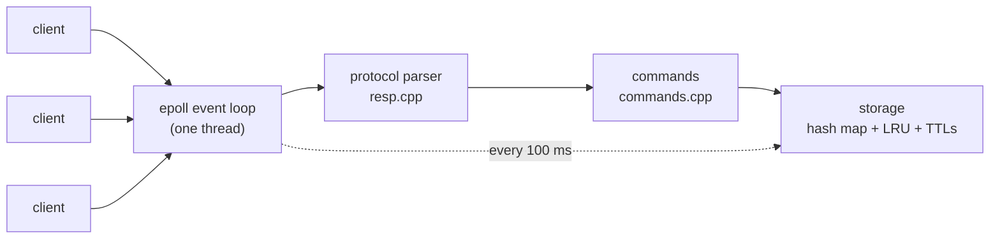

# kvstore — a Redis clone in C++

A working, in-memory key-value store built from scratch in C++17.

It speaks Redis's real network protocol, so the official `redis-cli` and
`redis-benchmark` tools connect to it and work normally. About 1,400 lines, no
libraries beyond the C++ standard library.

```console
$ ./server
kvstore listening on port 6380 (epoll event loop)

$ redis-cli -p 6380
127.0.0.1:6380> SET name vaibhav EX 60
OK
127.0.0.1:6380> GET name
"vaibhav"
127.0.0.1:6380> TTL name
(integer) 60
```

---

## Quick start

You need Linux (or WSL on Windows), `g++`, `make`, and `redis-tools`.

```bash
git clone https://github.com/<your-username>/kvstore.git
cd kvstore
make                 # build
make test            # run all tests
./server             # start it on port 6380
```

In a **second** terminal:

```bash
redis-cli -p 6380
```

Try:

```
PING
SET name vaibhav
GET name
INCR counter
SET temp hello EX 10
TTL temp
DBSIZE
```

Stop the server with `Ctrl+C`.

**Try the rate limiter demo** (with the server running):

```bash
python3 examples/ratelimit.py
```

**Benchmark it:**

```bash
redis-benchmark -p 6380 -t set,get -n 100000 -c 50 -q
```

---

## What it does

**Stores keys and values in memory**, like a cache. Every operation is O(1) on
average.

**Expires keys automatically.** `SET session abc EX 300` deletes itself after
5 minutes. Useful for sessions, caches, and rate limits.

**Evicts old keys when full.** Start it with `./server 6380 100000` and it keeps
at most 100,000 keys, throwing away whichever was used least recently.

**Handles thousands of clients at once** on a single thread, using the Linux
`epoll` system call.

### Commands

```
PING  ECHO  SET  SETEX  GET  DEL  EXISTS
EXPIRE  PEXPIRE  TTL  PTTL  PERSIST
INCR  DECR  INCRBY  DECRBY
DBSIZE  INFO  QUIT
```

`SET` supports `EX seconds` and `PX milliseconds`.

---

## How it's put together



| File | What it does |
|---|---|
| `src/server.cpp` | Networking — accepts connections, reads and writes sockets |
| `src/resp.cpp` | Understands Redis's wire format |
| `src/commands.cpp` | Runs commands like `GET` and `SET` |
| `src/store.cpp` | The actual storage: hash map, LRU list, expiry |
| `examples/ratelimit.py` | A rate limiter built on this server |

One useful design choice: **the protocol parser does no networking.** It takes a
buffer of bytes and returns a command, nothing more. That meant it could be
tested without a socket, and when the networking was rewritten from blocking I/O
to an event loop, the parser needed **zero changes**.

---

## Things I learned by measuring

Each section below is a problem I hit, measured, and fixed.

### 1. The first version broke completely with 50 clients

The original server handled one client at a time: accept a connection, serve it
until it disconnects, then accept the next. With one client it did ~18,000
operations/second. With 50 clients it did **zero** — it hung forever.

You can watch this happen. `Recv-Q` on a listening socket is the number of
connections Linux has accepted on your behalf that your program hasn't picked up
yet:

```console
$ ss -ltn | grep 6380
LISTEN 49  4096  0.0.0.0:6380
       ^^ 49 clients stuck waiting
```

The clients saw no error — Linux completes the TCP handshake for you, so as far
as they knew they were connected. They just waited forever.

**The fix** was an `epoll` event loop: instead of waiting on one socket, ask the
kernel to watch all of them and tell you which are ready.

| Clients | Before | After |
|---:|---|---|
| 50 | **0** (hangs) | **45,913/sec**, 0.54 ms |
| 200 | 0 | 45,249/sec, 2.20 ms |
| 500 | 0 | 42,671/sec, 5.56 ms |

`Recv-Q` now stays at 0 even with 400 connections open.

### 2. The bottleneck wasn't the code I expected

At 18,000 ops/sec I assumed the hash map was slow. It wasn't — a hash lookup
takes about 100 nanoseconds, which would allow millions per second.

The real cost was **system calls**: one `read()` and one `write()` per command,
each a switch into the kernel and back. Sending 16 commands at once
("pipelining") spreads those two calls across 16 operations:

```
1 command at a time     17,985/sec
16 at a time           212,765/sec     ~12x faster
```

Same code, same data structure. This is why the server now batches all replies
from one read into a single write.

### 3. Deleting expired keys was 55× slower than it should have been

Keys with a TTL that nobody reads still need cleaning up, so a background task
runs every 100 ms and deletes expired ones. It worked, but badly:

```
100,000 expired keys took 17,267 rounds to clean up
= about 29 minutes
```

Worse, it got *slower* as the store grew — 18.9 keys cleaned per round at 1,000
keys, but only 5.8 at 100,000.

**Why:** it picked random slots from the main hash table. But C++'s hash map
never shrinks, so once most keys were deleted there were ~100,000 slots holding
a handful of keys. Almost every random pick found an empty slot.

**Fix:** keep a separate list of only the keys that actually have an expiry
time, and pick from that instead. Now every pick is a real candidate.

| Keys | Before | After |
|---|---|---|
| 1,000 | 5.3 s | **0.4 s** |
| 10,000 | 65 s | **3.2 s** |
| 100,000 | 29 min | **31 s** |

And the rate no longer degrades as the store grows.

### 4. A client could run the server out of memory

Found by deliberately attacking it. A client can say "I'm sending a 200 MB
value", then send it slowly. The server can't process an incomplete command, so
it buffers everything — and there was no limit. 2 MB of input grew the server
from 7.8 MB to 14 MB, with nothing stopping it going further.

**Fix:** cap how much unfinished input one connection can hold (64 MB), then
disconnect it. Verified: the attack now stops at exactly 64 MB, memory returns to
normal, and other clients are unaffected.

### 5. Error messages could be used to forge replies

Replies like `-ERR unknown command 'X'` end at the first line break. If `X` came
from the client and contained a line break, the client's library would see
**two** replies where the server sent one — and every reply after that would be
misread. Same idea as HTTP response splitting.

**Fix:** strip line breaks from anything the client supplied before putting it in
an error message.

---

## Honest limitations

- **Data is lost on restart.** No saving to disk yet.
- **Only strings.** No lists, sets, or sorted sets.
- **One CPU core.** Deliberate — one thread means no locks are needed anywhere.
  Redis works the same way; using more cores means running several copies.
- **Measured on WSL2**, which is noisy. Where the noise was bigger than the
  effect I was measuring, I've said so rather than quoting a number I can't
  stand behind. In particular, the single-client comparison between blocking I/O
  and `epoll` was **inconclusive** — re-running the same build minutes apart gave
  17,985 and then 9,722 ops/sec. The multi-client results are far above the noise
  and are solid.

---

## Testing

```console
$ make test
ALL TESTS PASSED (0 failures)          # protocol
ALL STORE TESTS PASSED (0 failures)    # storage
ALL COMMAND TESTS PASSED (0 failures)  # commands
```

Two tests worth mentioning:

- **One byte at a time.** A command is fed to the parser a single byte at a
  time, checking it only reports success on the very last byte. Network data
  arrives in arbitrary chunks, and assuming "one read = one command" is the
  mistake that breaks most hand-written servers.
- **20,000 random operations** checked against a separate simple model, to catch
  bugs in the O(1) removal logic that a hand-written test would miss.

---

## What I'd do differently

1. Reply building allocates a new string every time. Reusing one buffer per
   connection would avoid that.
2. C++'s hash map resizes all at once, which causes a latency spike. Redis
   spreads the work out instead.
3. Connections are stored in a hash map keyed by file descriptor. Since those
   are small numbers, a plain array would be faster.
4. Benchmark on real hardware, not WSL2. Chasing a "performance regression" that
   turned out to be measurement noise cost me an hour.

---

## Roadmap

- [x] TCP server and Redis protocol
- [x] `epoll` event loop
- [x] Key expiry and LRU eviction
- [x] Atomic counters and rate-limiter example
- [ ] Saving to disk and crash recovery
- [ ] Sorted sets (skip list)
- [ ] Replication

---

## Acknowledgements

Built with **Claude Code (Claude Opus 5)** as a pair-programming and teaching
partner. Claude wrote and reviewed much of the implementation; the measurements
above, the failures they exposed, and the design decisions were worked through
together. The expiry bottleneck and the memory-exhaustion bug were both found by
testing rather than by reading the code.
