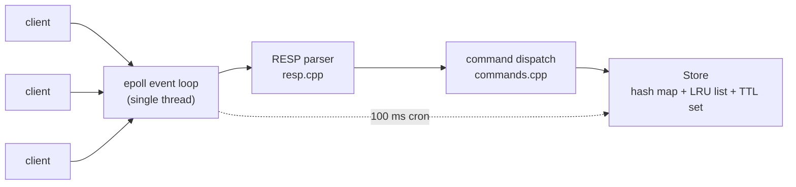

# kvstore

A Redis-compatible in-memory key-value store written from scratch in C++17.

Speaks the real RESP wire protocol, so it works with unmodified `redis-cli` and
`redis-benchmark`. Single-threaded epoll event loop, TTL expiry, and LRU
eviction — roughly 1,100 lines with no dependencies beyond the C++ standard
library and the Linux syscall interface.

```console
$ ./server
kvstore listening on port 6380 (epoll event loop)

$ redis-cli -p 6380
127.0.0.1:6380> SET name vaibhav EX 60
OK
127.0.0.1:6380> GET name
"vaibhav"
127.0.0.1:6380> TTL name
(integer) 60
```

---

## Why this exists

I wanted to understand the things that sit underneath every backend system —
sockets, I/O multiplexing, wire protocols, cache eviction — by building one
rather than reading about it. Each phase was driven by measuring a real failure
in the previous one.

---

## Architecture



| File | Responsibility |
|---|---|
| `src/server.cpp` | epoll event loop, connection state, non-blocking I/O |
| `src/resp.cpp` | RESP2 parser and reply encoders — **pure, no I/O** |
| `src/commands.cpp` | command dispatch and argument validation |
| `src/store.cpp` | hash map + LRU list + TTL set, lazy and active expiry |

The parser is a pure function over a buffer:

```cpp
ParseResult parse_command(const std::string& buf,      // const: never mutated
                          std::vector<std::string>& args,
                          size_t& consumed,            // 0 unless a whole command parsed
                          std::string& err);
```

It performs no I/O and cannot erase from the buffer — the caller decides. That
made it unit-testable without a socket, and it meant swapping blocking reads for
an epoll loop in Phase 3 changed **zero lines** of protocol code.

---

## Commands

`PING` `ECHO` `SET` (with `EX`/`PX`) `SETEX` `GET` `DEL` `EXISTS` `EXPIRE`
`PEXPIRE` `TTL` `PTTL` `PERSIST` `DBSIZE` `INFO` `QUIT`

---

## Measurements

WSL2 on Windows 11, single core in use. Run-to-run variance on this platform is
high — figures below are representative runs, and where the noise exceeded the
effect I have said so rather than quoting a number.

### The problem that motivated the event loop

The Phase 2 server was a blocking `accept()` → serve-to-completion loop. It
worked fine for one client and **failed completely** for fifty:

| Concurrent clients | Blocking server | epoll event loop |
|---:|---|---|
| 1 | ~18,000 SET/s | ~comparable (see note) |
| 1, pipelined ×16 | 212,765 SET/s | — |
| 50 | **0 — deadlocks, never completes** | **45,913 SET/s**, p50 0.54 ms |
| 200 | 0 | **45,249 SET/s**, p50 2.20 ms |
| 500 | 0 | **42,671 SET/s**, p50 5.56 ms |

The failure is directly observable in the kernel. `Recv-Q` on a listening socket
is the number of connections the kernel has fully established that the
application has not yet `accept()`ed:

```console
# blocking server, 50 clients                # epoll server, 200 clients
$ ss -ltn | grep 6380                        $ ss -ltn | grep 6380
LISTEN 49  4096  0.0.0.0:6380                LISTEN 0  4096  0.0.0.0:6380
       ^^ 49 clients stranded                       ^ backlog never builds
```

Clients see no error — their `connect()` succeeded, because the TCP handshake is
completed by the kernel. They just wait forever.

> **Note on the single-client figure.** epoll measured slower than blocking at
> one client, which is expected — it costs an extra `epoll_wait()` and an extra
> `read()` returning `EAGAIN` per request. But re-running the *blocking* build
> minutes later gave 9,722 ops/sec where it had earlier given 17,985. The
> machine's run-to-run spread was larger than the difference between the two
> designs, so the honest conclusion is **no measurable difference at one
> connection on this hardware**. The concurrency result is far above the noise
> and is solid.

### Pipelining is a syscall story

At ~18,000 ops/sec the hash map is not the bottleneck — a lookup is ~100 ns,
which would allow millions per second. The limit is **syscalls**: one `read()`
and one `write()` per command. Pipelining 16 commands amortises those two
syscalls across sixteen operations:

```
1 client, no pipelining     17,985 SET/s    p50 0.055 ms
1 client, -P 16            212,765 SET/s    p50 0.063 ms    ~12x
```

Throughput rose 12× while p50 barely moved — the signature of a syscall-bound
workload. The server exploits this by batching all replies from one `read()`
into a single `write()`.

### Optimising active expiry: 55× fewer cycles

Keys with a TTL that nobody reads must still be reclaimed, so a 100 ms cron
samples keys and deletes expired ones. The first implementation sampled random
**buckets of the main hash table**, and it degraded badly as the table grew:

```
keys      cycles to drain    keys reaped per cycle
1,000     53                 18.9
10,000    651                15.4
100,000   17,267              5.8   <- getting worse with size
```

At a 100 ms cron, 17,267 cycles is **29 minutes** to reclaim 100k expired keys.

**Cause:** `std::unordered_map` never shrinks its bucket array. Once most keys
are deleted, ~100,000 buckets hold a handful of keys, so nearly every random
probe lands on an empty bucket. The drain tail collapses.

**Fix:** keep a separate vector of exactly the keys that carry a TTL — the
equivalent of Redis's `expires` dictionary — with each key's slot index stored
in its entry so removal is an O(1) swap-with-last. Every sample is then a real
candidate.

```
keys      cycles: before -> after     wall time at 10 cycles/sec
1,000     53      ->   4              5.3 s   -> 0.4 s
10,000    651     ->  32              65 s    -> 3.2 s
100,000   17,267  -> 313              29 min  -> 31 s
reaped/cycle  18.9->5.8 (degrading)   ~250-320 (flat)
```

Each cycle is also capped by a wall-clock budget so it cannot stall the event
loop. **This part is unproven:** measuring per-cycle latency five times per
build gave a spread (max 1.8–6.7 ms) wider than the budget's effect. It is kept
because it is correct in principle and matches Redis, not because I measured a
win here.

---

## Design decisions

**Single-threaded, no locks.** One command runs at a time, so a data race on the
store is impossible by construction — the `Store` has no mutex anywhere. This is
the same reason Redis executes commands on one thread. Using more cores means
running several instances sharded by key, as Redis Cluster does.

**Length-prefixed protocol.** RESP bulk strings carry an explicit byte count, so
values are binary safe — a value may contain `\r\n` or a NUL byte with no
escaping. Verified by round-tripping such a value byte-exactly.

**Simple strings are not binary safe, and that is a vulnerability.** `+OK\r\n`
and `-ERR …\r\n` terminate at the first CRLF. Splicing client-controlled text
into an error lets a client forge a second reply and desynchronise every
subsequent one — the same class of bug as HTTP response splitting. Error replies
scrub CR/LF before echoing any client input.

**Monotonic clock for TTLs.** Deadlines come from `steady_clock`, not wall time.
An NTP correction must not make keys expire early or late.

**The cron is `epoll_wait`'s timeout.** Passing `100` instead of `-1` gives a
single-threaded server a heartbeat for background work with no second thread and
no timer signal.

**Non-blocking writes need an output buffer.** A non-blocking `write()` can send
part of a reply and return `EAGAIN`, so each connection buffers what is left and
`EPOLLOUT` is armed **only while bytes are pending**. Leaving it armed spins the
loop at 100% CPU, since an idle socket is always writable.

---

## Testing

```console
$ make test
ALL TESTS PASSED (0 failures)        # protocol
ALL STORE TESTS PASSED (0 failures)  # store
```

Two suites worth calling out:

- **Byte-by-byte framing.** A command is fed one byte at a time and the parser
  is asserted to report `Ok` only when the final byte arrives, and to consume
  zero bytes on every partial state. TCP delivers a byte stream with no message
  boundaries, and "one `read()` = one command" is the assumption that breaks
  homemade servers under load.
- **Randomised TTL-set churn.** 20,000 random `SET`/`EXPIRE`/`PERSIST`/`DEL`
  operations checked against an independent model. The O(1) swap-with-last
  removal has to fix up the moved key's recorded index — the easiest place for a
  subtle bug to hide.

---

## Build and run

```console
$ make                        # builds ./server
$ make test                   # runs both suites

$ ./server                    # port 6380, unlimited keys
$ ./server 6380 100000        # port 6380, LRU eviction above 100k keys
```

Watch the accept queue under load:

```console
$ watch -n 0.5 'ss -ltn | grep 6380'
```

---

## What I would do differently

1. **Reply encoders allocate per call.** Each returns a `std::string`. Appending
   into a caller-owned buffer reused per connection would remove that
   allocation. This is the first thing I would change if profiling showed
   allocation pressure.
2. **`std::unordered_map` rehashes in one stop-the-world pass**, which spikes
   tail latency when the table doubles. Redis spreads rehashing incrementally
   across operations to bound p99. Implementing that is the natural next
   optimisation.
3. **Connections are stored in a hash map keyed by fd.** File descriptors are
   small dense integers, so a flat vector indexed by fd would be faster and
   simpler. Redis does this.
4. **Benchmark on real hardware.** WSL2's scheduling noise made sub-millisecond
   effects unmeasurable and cost me time chasing a "regression" that was noise.

---

## Roadmap

- [x] Blocking TCP server
- [x] RESP protocol parser and core commands
- [x] epoll event loop
- [x] TTL expiry (lazy + active) and LRU eviction
- [ ] Append-only log with crash recovery
- [ ] Skip list for sorted sets
- [ ] Leader–follower replication

---

## Acknowledgements

Built with **Claude Code (Claude Opus 5)** as a pair-programming and teaching
partner. Claude wrote and reviewed much of the implementation; the measurements,
the failures they exposed, and the design decisions documented above were worked
through together. The active-expiry bottleneck in particular was found by
benchmarking rather than by inspection.
